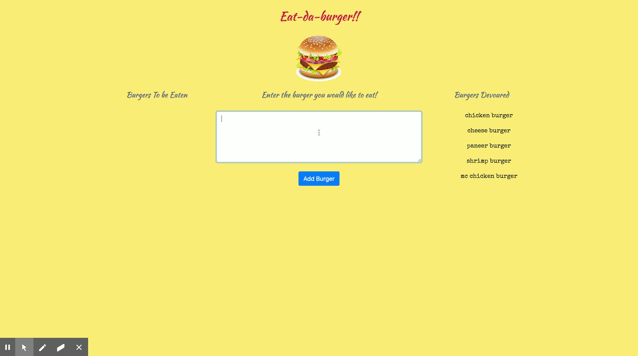
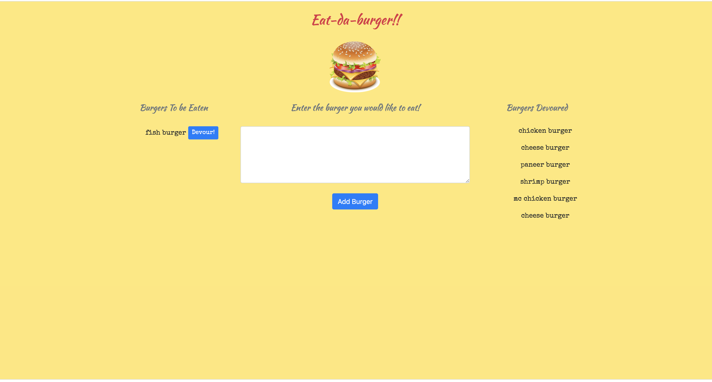
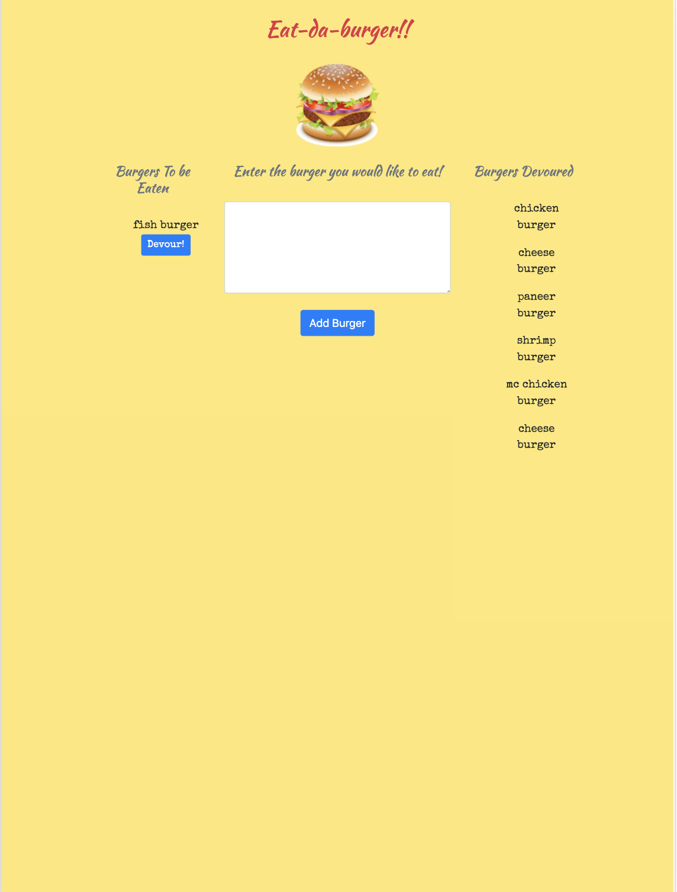
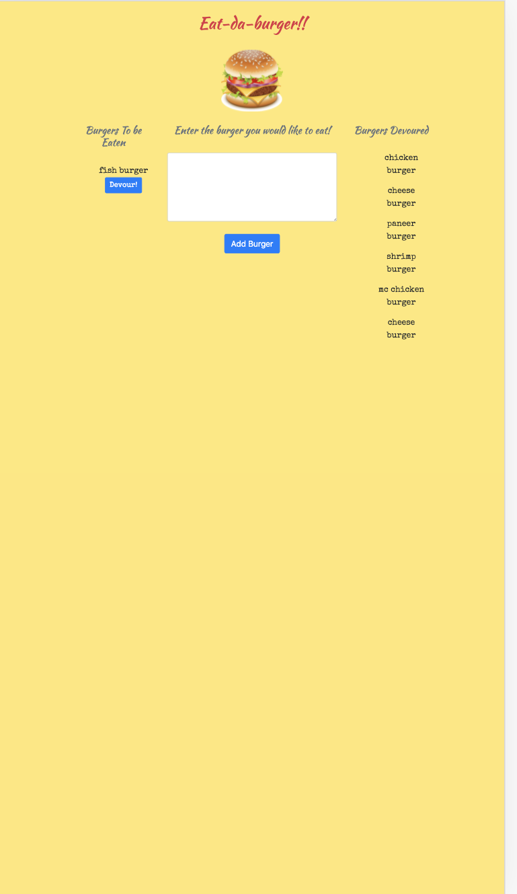

# eat-da-burger!!


# Goal :

Create a burger logger: Eat-Da-Burger restaurant app with MySQL, Node, Express, Handlebars and ORM.


# Table of Contents

* [Demo](#demo)
* [Screenshots](#screenshots)
* [Technology](#technology)
* [Tools](#tools)
* [Features](#features)
* [License](#license)
* [Contribution](#contribution)


# Deployed Website: 

[eat-da-burger](https://application-eat-da-burger.herokuapp.com/)

# Demo :


# Screenshots :

|Medium Devices/ Laptop|Small Devices/ Tablet|Extra Small Devices/Phone
|--|--|--
||| 

 # User Story

```
'Eat-Da-Burger!' is a restaurant app that lets users input the names of burgers they'd like to eat.

Whenever a user submits a burger's name, app will display the burger on the left side of the page -- waiting to be devoured.

Each burger in the waiting area also has a Devour it! button. When the user clicks it, the burger will move to the right side of the page as 'Devoured'.

App will store every burger in a database, whether devoured or not.
```

# Technology :

**1. [MySQL](https://www.npmjs.com/package/mysql2)** : 

* MySQL is an open-source relational database management system.

* A relational database organizes data into one or more data tables in which data types may be related to each other; these relations help structure the data.

**2. [Express.js](https://expressjs.com/)** :

* Web Applications : Express is a minimal and flexible Node.js web application framework that provides a robust set of features for web and mobile applications.

* APIs : With a myriad of HTTP utility methods and middleware, creating a robust API is quick and easy.

**3. [Node.js](https://nodejs.org/en/)** : 

* Node.js is an open-source and cross-platform JavaScript runtime environment. 

* A Node.js app is run in a single process, without creating a new thread for every request. 

**5. [Handlebars.js](https://www.npmjs.com/package/handlebars)** :

* Fast execution: Handlebars compiles templates into JavaScript functions. This makes the template execution faster than most other template engines.

* Mustache-compatible: Handlebars is largely compatible with Mustache templates. In most cases it is possible to swap out Mustache with Handlebars and continue using your current templates.


# Features :

* Followed MVC(Model-View-Controller) design pattern.

* Used Node and MySQL to store data of the burgers and route data.

* Used handlebars.js to generate dynamic HTML pages.

* App will store every burger in a database, whether devoured or not.

# License

This project is licensed under MIT license.

# Contribution :

[Pratyusha Raghupatruni](https://github.com/PratyushaRaghupatruni)

This app is licensed under the MIT licensing model. Feel free to fork the repo or clone it locally to your machine and make whatever changes you'd like.